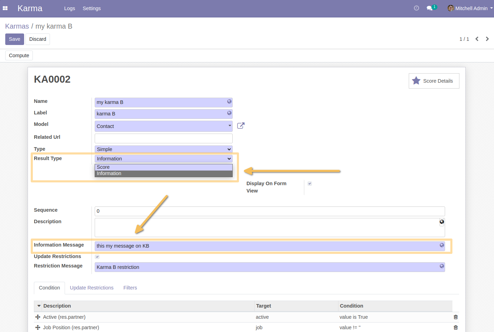
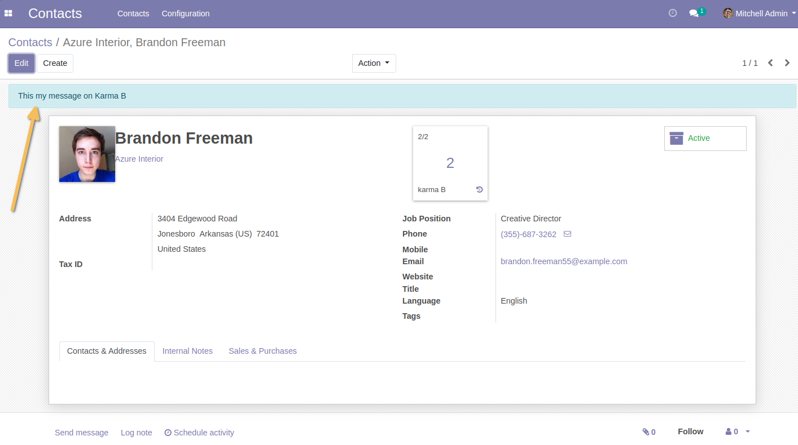
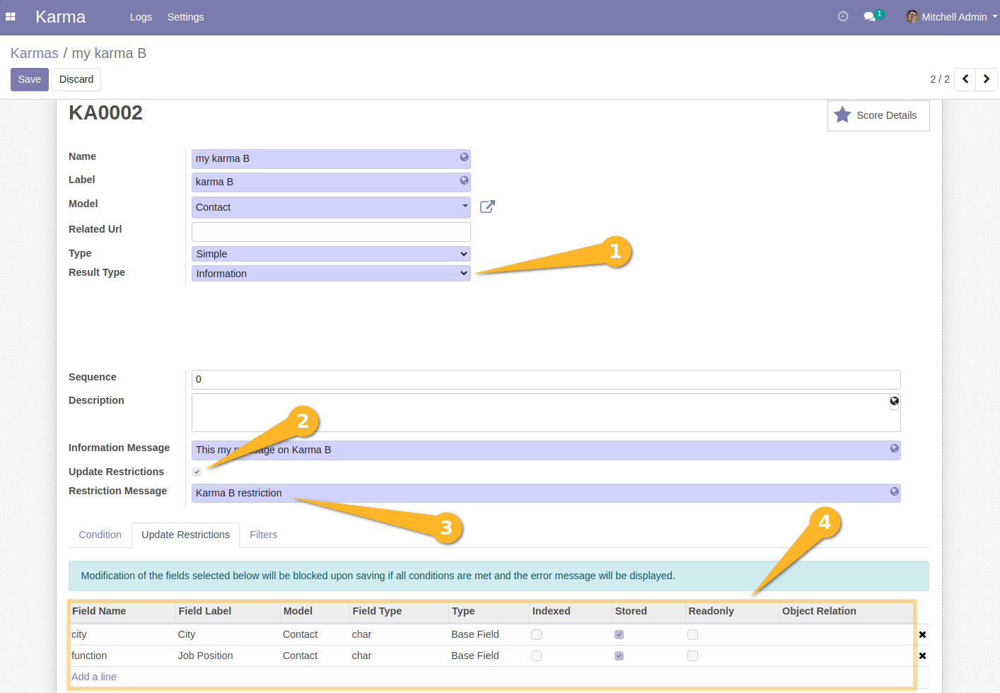

Karma Dynamic User Message
==========================
This module helps to enrich the Karma operation in order to have a blocking message on
one of the fields of a record, if the condition configured in the Karma model is true.

Usage
-----
*New Karma feature to display a non-blocking information message on a record*
In a karma form view, I have a new fields called `Result Type` and `Information Message`.
The `Information Message` field is only displayed when the `Result Type` field is set to `Information`.

When I select `Information` in the `Result Type` field, the `Information Message` field
will be displayed and must be filled.

If all the lines in the Conditions tab are met (true), then the target record (form view) displays
a banner at the top of the form with the information message.

*Constraint on conditional field modification*
Under the field `Information Message`, there is a checkbox `Update Restrictions`.
If activated, you can apply a blocking exception on selected fields changes.
The blocking message is set in the `Restriction Message` field.

IMPORTANT : ``Constraint is only applied when all the lines in the Conditions tab are met (true).``

Contributors
------------
* Numigi (tm) and all its contributors (https://bit.ly/numigiens)
