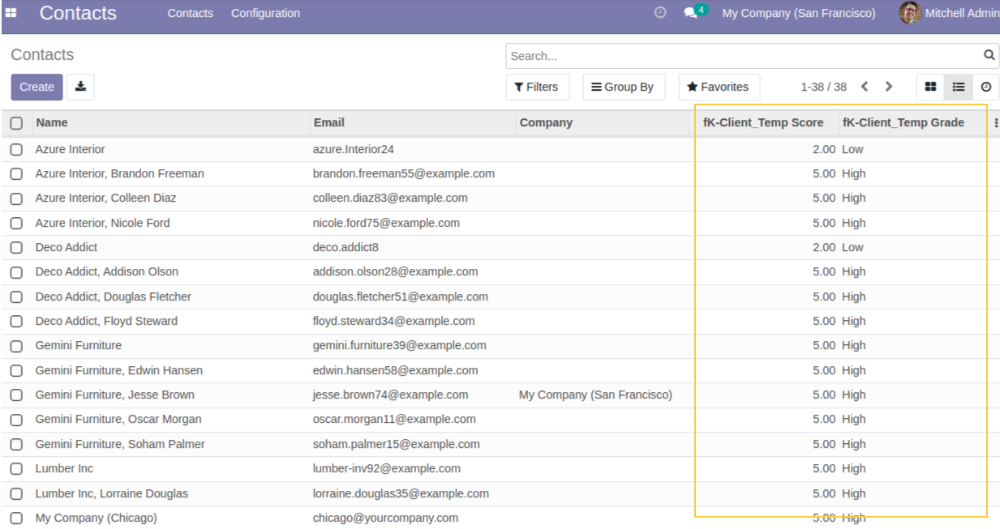

Karma Properties
================

This module allows to search, group, filter and add in the views the Karma score and grade of any specified model.

**Table of contents**

.. contents::
   :local:

Context
-------

In the current version of the application Karma, it is not possible to search, filter or group on Karma Score or Grade because this information is not stored in stored fields on the model but rather in a widget.

Usage
-----

As a user with access to the Karma application, I access the form view in ``Configuration > Karmas``. 
When creating a Karma, in the form view, I notice that a new button ``Field properties`` is available.

When I click on the new button, I notice the presence of 2 new checkboxes:
 - Show Grade
 - Show Score

I also notice that the ``Field Properties`` button is no longer displayed.

I can activate one or both checkboxes depending on my needs.

I activate the checboxes on the defined model, in this example the model is ``Partner``

I notice that the 2 new fields ``{karma_name} Grade`` and ``{karma_name} Score`` are available in the list view (Partners list view in this example).
And they are calculated from Karma scores

I notice also that I can filter and grouby the fields ``{karma_name} Grade`` and ``{karma_name} Score``:

Contributors
------------
* Numigi (tm) and all its contributors (https://bit.ly/numigiens)

More information
----------------
* Meet us at https://bit.ly/numigi-com
